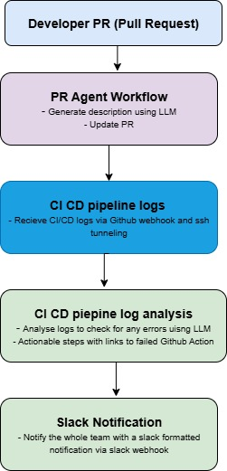

writing pull request descriptions and deciphering complex CI/CD logs. I built an AI-powered agent to solve this by integrating directly with GitHub to analyze code changes, automatically generating clear and consistent PR summaries. The agent also monitors CI/CD pipelines, using an LLM to transform raw output into actionable insights that are delivered in real-time via Slack, streamlining the development cycle and enhancing team-wide communication.

  

